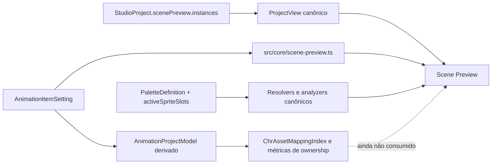

# Auditoria: Scene & Multi-Entity Preview

**Data:** 28 de agosto de 2026

**Milestone alvo:** [10. Scene & Multi-Entity Preview](https://github.com/Andropovbr/png2chr-studio/milestone/11)

**Histórico principal:** [#28 — Promote Scene Preview to an Animation subworkspace](https://github.com/Andropovbr/png2chr-studio/issues/28), [#126 — Integrate palette selectors and color preview](https://github.com/Andropovbr/png2chr-studio/issues/126)

**Escopo desta entrega:** investigação e planejamento; nenhuma mudança de comportamento de produção

---

## 1. Resumo executivo

A Scene não começa do zero. O `main` já contém um preview multi-entidade funcional, persistência em `.p2c`, seleção e edição de instâncias, reprodução independente, posicionamento por formulário e arrasto, integração com o subworkspace Animation, renderização com pixel overrides e paletas lógicas, além de diagnósticos de capacidade dos quatro slots SPR.

Classificação recomendada: **B — meaningful work remains**.

A fundação de domínio está pronta, mas ainda há trabalho significativo de integridade e UX antes de considerar a milestone concluída. Os principais problemas são referências de animação baseadas em nomes mutáveis, semântica de posicionamento desconectada das âncoras, montagem duplicada do painel fora da aba Scene, perda de playback em rerenders, lifecycle incompleto de listeners, interação de canvas somente por mouse, cobertura limitada de interação direta e ausência de contexto/navegação para os modelos canônicos de CHR e ownership.

O trabalho recomendado é uma consolidação, não uma reimplementação. Não há justificativa para criar novo allocator, novo modelo de ownership, novo sistema de paletas ou um validador NES específico da Scene.

---

## 2. Método e fontes examinadas

A auditoria considerou:

- implementação atual em `src/core/scene-preview.ts`, `src/ui/scene-preview-panel.ts`, `src/ui/animation-editor.ts`, `src/main.ts` e `src/ui/workspace-state.ts`;
- persistência e migração em `src/core/project.ts` e seus testes;
- integração de paletas em `src/core/palette-manager.ts`, Animation, Delivery e documentação do Palette Manager;
- modelos derivados de animação, CHR, asset mapping e ownership;
- testes de Scene, Project, Animation Editor e Palette Manager;
- documentação de arquitetura, formatos, fronteiras de estado e smoke tests;
- histórico dos commits `6f49957` (preview multi-entidade), `da481dc` (#28, promoção para subworkspace) e `3f13961` / PR #134 (#126, integração canônica de paletas);
- branch histórica não mesclada `feat/nes-validation` apenas para identificar sobreposição de escopo. Ela não foi tratada como fonte de verdade do `main`.

Testes focados executados durante a investigação:

```text
npm test -- src/core/scene-preview.test.ts src/core/project.test.ts \
  src/ui/animation-editor.test.ts src/core/palette-manager.test.ts

4 arquivos, 124 testes aprovados
```

### 2.1 Revisão especializada

Seu Camilo revisou somente as ambiguidades de identidade, persistência, âncora e consumo de modelos derivados. O parecer rejeitou o fallback por nome e a semântica top-left como estado final, recomendou `animationId` canônico com migração legada não ambígua, posição canônica por âncora e consumo read-only de `AnimationProjectModel` / `ChrAssetMappingIndex` fornecidos pelo orquestrador. Nenhum arquivo foi alterado pelo revisor.

Professor Carvalho não foi acionado: a auditoria separa informação factual de recursos da futura validação de hardware e não depende de nova conclusão sobre scanlines, OAM ou mapper.

---

## 3. Estado atual e fontes canônicas



As instâncias são estado persistente do projeto. Seleção da instância, aba ativa e demais preferências de apresentação pertencem ao `WorkspaceState` e não sujam o projeto. Playback é estado efêmero do painel e não deve entrar no `.p2c` sem uma decisão de produto separada.

`AnimationProjectModel`, `ChrAssetMappingIndex`, métricas de ownership e diagnósticos continuam derivados. A Scene deve recebê-los do orquestrador quando precisar de fatos de recursos ou navegação física; não deve executar builders, reconstruir relações por pixels nem persistir cópias desses dados. `src/core/scene-preview.ts` hoje importa `AnimationItemSetting` de `src/ui/types.ts`; mudanças futuras devem evitar reforçar essa inversão e preferir um shape mínimo de core ou o modelo canônico.

---

## 4. O que já está completo

### 4.1 Instâncias e persistência

- `ScenePreviewInstance` representa ID, entidade, animação, X/Y, visibilidade e nome opcional.
- O projeto possui uma única configuração `scenePreview.instances`, com ordem estável no array.
- Criação, duplicação, remoção e edição passam por `updateProject(...)` e marcam o projeto como alterado.
- Seleção usa `WorkspaceState.animation.selectedSceneInstanceId` e não é serializada.
- `serializeProject` preserva a Scene; `deserializeProject` tolera ausência do bloco e sanitiza os campos básicos.
- Existe teste de round-trip com múltiplas instâncias, nomes, coordenadas e visibilidade.

### 4.2 Seleção, edição e composição

- A aba `Animation > Scene` possui canvas NES 256×240, lista de instâncias e inspetor contextual.
- A instância pode ser selecionada pela lista ou pelo canvas.
- O inspetor edita nome, entidade, animação, X, Y e visibilidade.
- A interface permite adicionar, duplicar e remover instâncias.
- A ordem do array define desenho e hit testing; a instância desenhada por último é escolhida primeiro em sobreposição.
- O canvas mostra grid 16×16 e bounding box da seleção.
- O layout é responsivo e move o inspetor para baixo em viewports menores.

### 4.3 Reprodução independente

- Cada instância possui `InstancePlaybackState` próprio, indexado pelo ID da instância.
- Durações por frame e duração padrão são respeitadas.
- Os modos `loop` e `once` são tratados.
- Instâncias ocultas não avançam enquanto ocultas.
- O painel oferece Play/Pause e Reset e converte tempo de animação em ticks de 60 Hz.
- Testes de domínio cobrem avanço independente, reset, mudança de animação e instâncias ocultas.

### 4.4 Renderização de Animation e paletas

- A Scene usa o spritesheet quantizado da animação e aplica `pixelOverrides` antes do recorte do frame.
- A paleta efetiva segue `framePaletteIds[frame] ?? animation.paletteId`, com fallback legado somente para renderização.
- Cores são resolvidas pelas funções canônicas do Palette Manager.
- O painel mostra slot SPR ativo/inativo por instância.
- `resolveScenePaletteIds` considera somente instâncias visíveis e frames renderizáveis.
- `analyzeScenePalettes` deduplica IDs simultâneos e informa paletas sem slot ativo.
- O alerta de mais de quatro paletas distintas foi integrado por #126 e possui testes de regressão.
- Delivery reutiliza os diagnósticos estruturados do Palette Manager; não há um validador paralelo na UI da Scene.

### 4.5 Integração indireta com CHR e ownership

- A animação consumida pela Scene também alimenta `AnimationProjectModel`, alocação de CHR, metasprites, exporters e `ChrAssetMappingIndex`.
- Edições canônicas de pixel/CHR voltam para as fontes do projeto e podem ser refletidas pela Scene no próximo render.
- Mapeamento físico, ownership, compartilhamento, Base CHR e métricas já existem como modelos derivados fora da Scene.
- Animation já possui navegação `Inspect in CHR` a partir do mapeamento de metasprites.

### 4.6 Cobertura existente

- `src/core/scene-preview.test.ts` cobre entidades, resolução de animações, criação, playback, frames e consumo de paletas.
- `src/core/project.test.ts` cobre round-trip de instâncias.
- `src/ui/animation-editor.test.ts` cobre a aba Scene, lista, seleção, inspector, duplicação, visibilidade e alertas de paleta.
- `src/core/palette-manager.test.ts` cobre análise e diagnóstico de contextos de Scene.

---

## 5. Lacunas reais

### 5.1 Referência de animação frágil e fallback silencioso — alta prioridade

Instâncias persistem `entityId + animationName`, embora animações já tenham `AnimationItemSetting.id` estável. Renomear entidade/animação ou remover a animação não reconcilia as instâncias. Quando a entidade ainda existe mas o nome não é encontrado, `resolveInstanceAnimation` usa silenciosamente a primeira animação da entidade.

Impactos:

- uma edição legítima pode mudar qual animação a instância mostra sem informar o usuário;
- referências stale permanecem no `.p2c`;
- Palette Workspace e Delivery repetem lookup por entidade/nome;
- a tradução `scenePreviewInvalidEntityWarning` existe, mas a UI não apresenta um estado de referência inválida;
- o modelo contradiz o uso de IDs estáveis adotado em Animation e asset lifecycle.

Direção recomendada: tornar `animationId` a referência canônica da instância. `entityId` e `animationName` podem permanecer como aliases legados derivados para compatibilidade. Na leitura legada, a migração só pode escolher um ID quando houver exatamente uma correspondência; zero ou múltiplas correspondências devem produzir referência não resolvida explícita. Rename preserva o ID. Delete preserva a referência dangling até reparo/remoção explícita ou aplica uma reconciliação confirmada; nunca reponta sozinho. O formato e a migração precisam de testes explícitos.

### 5.2 Coordenadas não têm contrato alinhado às âncoras — alta prioridade

O canvas interpreta `x/y` como canto superior esquerdo do frame e ignora `originX/originY`. O modelo de metasprites, porém, expressa cada sprite de hardware em coordenadas relativas à âncora. A documentação afirma que a Scene ajuda a verificar alinhamento de âncoras, algo que o render atual não sustenta.

Também há limites inconsistentes com o tamanho do frame: a UI aceita X=256 e Y=240, o que pode colocar o frame inteiro fora da tela, enquanto impede valores negativos que poderiam ser úteis para composição parcial. Isto é uma lacuna de contrato de produto, não prova automática de violação de hardware.

A posição canônica recomendada é a âncora da entidade na cena. O render normal parte de `anchorX - originX` e `anchorY - originY`; flips também devem ocorrer em torno dessa âncora. `x/y` legados continuam representando top-left para leitores antigos. Na migração, `anchor = posição legada + origin` somente quando a animação for resolvida de forma exata. Referências ausentes ou ambíguas ficam pendentes de reparo; não podem assumir origem zero. A conversão não deve aplicar clamp e deslocar silenciosamente o projeto.

### 5.3 Paridade de renderização incompleta

- Quando `flipH` e `flipV` estão ativos, o render da Scene usa `if/else if` e aplica somente um flip, embora o domínio aceite combinação H+V.
- Frame, paleta e transformação são resolvidos novamente dentro de `drawScene` em vez de consumir uma única projeção derivada por instância.
- O bounding box usa dimensões do frame, não posição de âncora nem bounds dos sprites efetivamente visíveis.
- Instâncias com animação stale podem renderizar fallback diferente do valor exibido no projeto.

A Scene deve reutilizar uma projeção canônica de frame/transformação. Não deve criar um segundo compilador de metasprites.

### 5.4 Promoção para subworkspace ficou incompleta

#28 adicionou a aba `Animation > Scene`, mas `createAnimationEditor` ainda monta outro `ScenePreviewPanel` como painel independente sempre que a aba ativa não é `scene`. Assim, a Scene continua presente abaixo dos demais painéis e mantém animação e listeners ativos mesmo quando o usuário trabalha em Frames, Pixels ou Mapping.

Além da duplicidade conceitual, isto mantém o custo de renderização e interação do canvas fora do subworkspace dedicado. A navegação lateral depende desse painel legado quando a aba Scene não está ativa, em vez de selecionar a aba correta.

### 5.5 Playback e lifecycle não sobrevivem a rerenders de edição

`playing` e `playbackStates` são criados dentro de `createScenePreviewPanel`. Quase toda seleção ou mutação chama `render()` global, desmonta o painel e reinicializa todas as instâncias no frame zero, inclusive ao selecionar um card, editar um campo ou arrastar.

O `MutationObserver` cancela o `requestAnimationFrame`, mas os listeners registrados em `window` para `mousemove` e `mouseup` não são removidos. Renders sucessivos acumulam closures antigas. Durante drag, o primeiro update pode desmontar o canvas usado para calcular coordenadas pelos movimentos seguintes.

O domínio suporta playback independente; a integração da UI ainda não preserva esse comportamento durante o fluxo normal de edição. Playback continua sendo transitório, mas precisa de ownership e cleanup claros.

### 5.6 Interação direta e acessibilidade são insuficientes

- Drag usa somente eventos de mouse, sem Pointer Events, touch ou pointer capture.
- O canvas tem `role="img"`, mas não é focável e não oferece seleção ou deslocamento por teclado.
- Cards de instância são `div` clicáveis sem papel interativo, `tabindex` ou handler de teclado.
- Visibilidade e remoção usam glifos como nome visual principal; `title` não substitui um nome acessível robusto em todos os fluxos.
- Não há anúncio acessível de seleção, coordenadas atualizadas ou frame atual.
- Não existem testes de mousedown/move/up, teardown de listeners, navegação por teclado, foco ou nomes acessíveis.
- Não há comando de reordenação, embora a ordem determine desenho e hit testing em sobreposições.

Os inputs nativos do inspetor são uma alternativa parcial ao drag, mas não tornam seleção e composição direta equivalentes para teclado e tecnologias assistivas.

### 5.7 Contexto de recursos CHR e navegação ainda não chegaram à Scene

O painel informa paletas, mas não mostra fatos já disponíveis sobre o frame atual, por exemplo:

- quantidade de sprites 8×8 renderizáveis no metasprite;
- slots físicos únicos consumidos pelo frame ou animação;
- PT ativa e índices físicos/local OAM;
- reutilização de Base CHR, compartilhamento e deduplicação;
- referência inválida ou animação sem modelo renderizável.

Esses fatos devem vir de `AnimationProjectModel`, `ChrAssetMappingIndex` e métricas existentes. A Scene não deve recalcular ownership a partir de pixels nem inferir alocação por igualdade de índices.

Faltam ações contextuais para:

- abrir a animação e o frame efetivo da instância;
- abrir a paleta lógica no Palette Workspace;
- inspecionar os tiles do frame na CHR Memory com os filtros canônicos;
- retornar da CHR/Animation ao contexto da instância selecionada quando possível.

### 5.8 Diagnóstico ao vivo e readiness não têm a mesma janela temporal

O painel calcula paletas usando o frame corrente de cada player. Delivery recebe a configuração persistida, sem estados de playback, e portanto resolve frame zero quando avalia a Scene. Ambas as respostas são coerentes com suas entradas, mas não representam a mesma pergunta.

Para esta milestone, a UI deve rotular claramente fatos de **frame corrente** e pode mostrar resumos derivados do modelo atual. Analisar todos os alinhamentos temporais possíveis, encontrar pico ao longo dos ciclos ou declarar validade NES global pertence à NES Validation.

---

## 6. Limite com a Milestone 11 — NES Validation

### Dentro de Scene & Multi-Entity Preview

- integridade das referências persistidas de instância para animação;
- render correto do frame e transformação selecionados;
- estado explícito para animação/paleta/asset ausente ou não renderizável;
- contagens factuais do frame corrente fornecidas pelos modelos canônicos;
- resolução de paleta corrente e disponibilidade nos slots SPR já modelados;
- métricas de CHR/ownership já derivadas e apresentadas como informação de recursos;
- navegação contextual para Animation, Palette e CHR Memory;
- comportamento de edição, lifecycle, acessibilidade e testes.

### Adiar para NES Validation

- limite total de 64 sprites OAM e política de severidade;
- oito sprites por scanline, prioridade, flicker e avaliação de sobreposição;
- pior caso ao longo de ciclos de animação independentes;
- semântica de coordenadas OAM fora da tela, wrap e diferenças de runtime;
- mapper, CHR-RAM, bank switching ou streaming;
- uma decisão global de “válido para NES” que combine Scene com outros subsistemas.

O limite de quatro subpaletas SPR já faz parte do domínio canônico de Palette Manager e pode continuar visível na Scene. A milestone posterior deve reutilizar esse fato, não criar outro contador incompatível.

Nenhuma conclusão desta auditoria depende de afirmar nova regra de hardware. Por isso, revisão do Professor Carvalho não foi necessária.

---

## 7. Escopo recomendado da milestone

### Classificação B — meaningful work remains

Justificativa:

- **Não é A:** referências mutáveis, semântica de âncora, lifecycle de playback/listeners, duplicidade do painel e acessibilidade afetam fluxos centrais.
- **Não é C:** domínio, persistência, render básico, reprodução independente, edição e paletas já existem e têm testes. Não é preciso construir uma Scene nova.
- **É B:** cinco incrementos focados consolidam a implementação existente e integram modelos já disponíveis.

### Não objetivos

Não incluir nesta milestone sem nova evidência de produto:

- biblioteca de múltiplas cenas nomeadas;
- composição de Background Maps, câmera ou scrolling;
- editor de colisão, triggers, scripts ou lógica de gameplay;
- exportação de cenas/runtime;
- novo allocator de CHR ou modelo de ownership;
- validador NES completo;
- persistência de frame corrente, relógio ou estado Play/Pause.

---

## 8. Issues de seguimento propostas

As issues abaixo são propostas; **não foram criadas** nesta investigação.

### 1. `core(scene): adopt stable animation identity and reconcile instance lifecycle`

**Dependências:** nenhuma.

Escopo:

- adicionar referência canônica por `animationId` às instâncias;
- definir leitura/migração compatível de `entityId + animationName`;
- remover fallback silencioso para outra animação;
- representar referências inválidas de forma estruturada;
- reconciliar rename, mudança de entidade e remoção de animação;
- atualizar Palette usage/diagnostics para consumir a resolução canônica;
- cobrir projetos legados, round-trip e casos ambíguos.

### 2. `core(scene): define anchor-aware placement and rendering parity`

**Dependências:** issue 1.

Escopo:

- formalizar o significado persistente de `x/y`;
- decidir e testar conversão de coordenadas legadas;
- alinhar posição visual com `originX/originY` e modelo de metasprite;
- definir bounds de edição como política do Studio, sem rotulá-los automaticamente como regra de hardware;
- suportar flip H, V e H+V;
- produzir uma projeção única de frame/transformação usada por render, hit testing e inspector.

### 3. `ui(scene): finish the dedicated subworkspace and stabilize playback lifecycle`

**Dependências:** issues 1 e 2.

Escopo:

- remover a montagem legada da Scene fora da aba dedicada;
- fazer navegação lateral selecionar `Animation > Scene`;
- manter estado transitório de playback durante seleção e edição sem persistir no projeto;
- evitar render global por cada movimento quando não necessário;
- centralizar mount/unmount e remover RAF, listeners e observers no teardown;
- preservar independência de instâncias durante add/remove/update.

### 4. `ui(scene): add accessible pointer, keyboard and ordering interactions`

**Dependências:** issues 2 e 3.

Escopo:

- migrar drag para Pointer Events com pointer capture;
- tornar lista e seleção do canvas operáveis por teclado;
- oferecer nudge previsível e alternativa explícita pelos inputs;
- fornecer nomes, foco e anúncios acessíveis para seleção, visibilidade e coordenadas;
- permitir reordenar instâncias sem alterar identidade;
- adicionar testes de interação direta, foco, teardown e regressões de sobreposição.

### 5. `integration(scene): expose canonical resource context and cross-workspace navigation`

**Dependências:** issues 1 e 3; pode avançar em paralelo com a issue 4 após estabilização do contrato.

Escopo:

- consumir `AnimationProjectModel`, `ChrAssetMappingIndex` e métricas existentes;
- mostrar fatos do frame corrente e rotulá-los como informação, não validação NES global;
- exibir estados de source/model/palette/CHR não resolvidos;
- navegar da instância para Animation/frame, Palette e CHR Memory;
- preservar seleção/contexto de retorno no `WorkspaceState` quando útil;
- não introduzir analyzers, ownership ou allocation específicos da Scene.

### Final quality pass: `test(scene): complete end-to-end quality pass and documentation`

**Dependências:** issues 1–5.

Escopo:

- regressões de migração, lifecycle de animações e persistência;
- playback independente durante edição e troca de abas;
- render com âncora, flips e frames/paletas diferentes;
- pointer, teclado, foco, reduced motion e teardown sem leaks;
- navegação Scene → Animation/Palette/CHR e retorno;
- verificação de métricas contra os modelos canônicos;
- atualização de README, arquitetura, formatos e smoke test;
- `npm test`, `npm run lint`, `npm run format:check` e `npm run build`.

---

## 9. Decisões arquiteturais para implementação futura

1. Instância de Scene referencia animação lógica; não referencia slot CHR.
2. Posição da instância e visibilidade são persistentes; seleção e playback continuam transitórios.
3. Recursos CHR, ownership e métricas são derivados do mesmo `AnimationProjectModel` e `ChrAssetMappingIndex` usados pelos demais workspaces.
4. Palette capacity usa os resolvers/analyzers do Palette Manager.
5. Integridade de referência deve ser explícita; fallback visual nunca deve mascarar uma referência quebrada.
6. Scene apresenta contexto factual. NES Validation decide regras sistêmicas e severidades de hardware.

---

## 10. Conclusão

Milestone 10 deve consolidar a Scene existente, não substituí-la. O resultado esperado é um subworkspace único, estável, acessível e conectado aos modelos canônicos do Studio. Com as cinco issues propostas e o quality pass final, a milestone pode encerrar lacunas reais sem antecipar um editor de fases ou duplicar a futura NES Validation.
