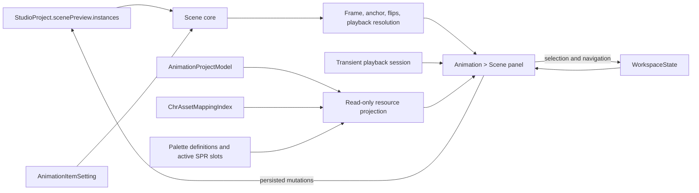

# Auditoria final: Scene & Multi-Entity Preview

**Data:** 28 de agosto de 2026

**Milestone alvo:** [10. Scene & Multi-Entity Preview](https://github.com/Andropovbr/png2chr-studio/milestone/11)

**Entregas reconciliadas:** #138–#143

**Status:** milestone implementada; auditoria final concluída

---

## 1. Resultado

A Scene é um subworkspace único de `Animation`, sustentado pelo projeto canônico e pelos mesmos modelos derivados usados pelos demais workspaces. A sequência #138–#142 resolveu as lacunas de identidade, posicionamento, lifecycle, acessibilidade e contexto de recursos levantadas na auditoria inicial. #143 acrescenta cobertura integrada do pipeline suportado, corrige a duplicação de instâncias com âncoras canônicas e sincroniza esta documentação.

Não foi criado exportador de Scene. A arquitetura atual não define formato de runtime ou exportação standalone para cenas; a fronteira externa suportada é o bloco `scenePreview` do projeto `.p2c`. Os exporters de animação, CHR e paleta continuam derivados de seus próprios modelos canônicos.

Também não há métrica de cobertura exclusiva ou limiar autoritativo para Scene no repositório. A qualidade é medida pelos testes comportamentais focados e pela suíte completa existente, sem novo sistema de cobertura.

---

## 2. Arquitetura final



### 2.1 Estado canônico persistido

`StudioProject.scenePreview.instances` é a única fonte persistida da Scene. Cada instância contém:

- `id`, identidade estável da instância;
- `animationId`, referência canônica da animação;
- `entityId` e `animationName`, aliases retrocompatíveis de exibição;
- `anchorX` e `anchorY`, posição canônica quando disponíveis;
- `x` e `y`, posição legada mantida para compatibilidade;
- `visible` e `name`;
- posição no array, que define ordem de renderização e hit testing.

Mutações de posição, visibilidade, conteúdo e ordem passam pelo dispatcher do projeto e marcam o projeto como alterado. Duplicação mantém `x/y` e âncoras sincronizados, inclusive quando o deslocamento encontra o limite do canvas.

### 2.2 Estado transitório de Workspace/UI

Não entram no `.p2c`:

- instância selecionada;
- aba contextual ativa;
- workspace ativo e contexto de retorno;
- Play/Pause e relógio independente de cada instância;
- foco e anúncios acessíveis pendentes;
- preview intermediário durante Pointer Events.

A sessão transitória de playback pertence ao orquestrador, sobrevive a rerenders e trocas de aba e é limpa quando o projeto é substituído. Cada painel montado possui teardown idempotente para RAF e listeners de Pointer Events.

### 2.3 Contexto derivado de recursos

`deriveSceneInstanceResourceFacts(...)` projeta dados read-only do frame atual a partir de `AnimationProjectModel` e `ChrAssetMappingIndex`. Resolução de paleta reutiliza o Palette Manager. A Scene exibe sprites, slots físicos, Pattern Tables, Base CHR, compartilhamento e paleta efetiva sem persistir cópias nem reconstruir ownership.

Navegação para Animation, Palette e CHR Memory escreve somente no `WorkspaceState`. Ao retornar à Scene, o painel reprojeta os dados canônicos atuais.

---

## 3. Findings resolvidos

| Finding inicial                           | Resolução final                                                                             |
| ----------------------------------------- | ------------------------------------------------------------------------------------------- |
| Referência por nome e fallback silencioso | `animationId` estável; referências ausentes ou dangling permanecem explícitas.              |
| Coordenadas desconectadas de origem       | Projeção usa âncora canônica e origem da animação; legado mantém posição visual compatível. |
| Flip H+V incompleto                       | Render aplica transformação combinada e usa a mesma projeção de posição.                    |
| Painel Scene fora da aba dedicada         | Scene monta somente em `Animation > Scene`; sticky preview não duplica o painel.            |
| Playback reiniciado por rerender          | Sessão transitória compartilhada reconcilia instâncias por ID e animação.                   |
| Listeners/RAF acumulados                  | Teardown explícito e idempotente antes da troca do shell.                                   |
| Canvas somente por mouse                  | Pointer Events com pointer capture e commit único no fim do arrasto.                        |
| Seleção e edição inacessíveis             | Cards focáveis, nomes ARIA, setas para mover, `Delete` e `Ctrl+Up/Down` para ordem.         |
| Sem contexto CHR/paleta                   | Projeção read-only canônica e navegação transitória para recursos relacionados.             |
| Duplicação desalinhava âncoras            | Duplicação desloca coordenadas legadas e âncoras pelo mesmo delta efetivo.                  |

Nenhuma contradição material de arquitetura, persistência ou ownership permaneceu após a inspeção do código, testes e documentação. Seu Camilo não foi necessário nesta passagem final. Nenhuma nova decisão de regra de hardware foi necessária; Professor Carvalho não foi acionado.

---

## 4. Cobertura final do pipeline

Cobertura automatizada relevante:

- `src/core/project.test.ts`: leitura, migração legada, referências ambíguas/ausentes e round-trip `.p2c`;
- `src/core/scene-preview.test.ts`: resolução por ID, playback independente, frame/paleta, projeção por âncora, flips, ordenação, recursos derivados e duplicação;
- `src/ui/animation-editor.test.ts`: montagem dedicada, múltiplas instâncias, render combinado, Pointer Events, teclado, foco, ordem, lifecycle, navegação e pipeline integrado load → UI → save/reload;
- `src/core/palette-manager.test.ts`: consumo e diagnóstico de paletas da Scene;
- `src/ui/state-update.test.ts`: separação entre projeto persistido e Workspace transitório.

O teste integrado usa assertions comportamentais. Snapshots de imagem ou arquivo não foram adicionados porque não existe export Scene standalone nem convenção de snapshot necessária para validar este fluxo.

Comandos focados:

```bash
npm test -- src/core/scene-preview.test.ts src/core/project.test.ts src/ui/animation-editor.test.ts src/core/palette-manager.test.ts src/ui/state-update.test.ts
```

Gates completos:

```bash
npm run format:check
npm run lint
npm run test
npm run build
```

---

## 5. Checklist de migração e compatibilidade

- [x] Projeto sem `scenePreview` carrega com configuração vazia.
- [x] Projeto com várias instâncias preserva IDs e ordem.
- [x] Referência legada `entityId + animationName` migra somente com match único.
- [x] Zero ou múltiplos matches produzem `animationId: ""` explícito.
- [x] `animationId` dangling não aponta automaticamente para outra animação.
- [x] Rename mantém identidade por ID e atualiza aliases de exibição.
- [x] Instâncias legadas sem âncora mantêm `x/y` como posição visual.
- [x] Edição posterior grava âncora e alias legado coerentes.
- [x] Save/reload preserva âncoras, visibilidade, nomes e ordem.
- [x] Seleção, aba, foco, playback e navegação não são serializados.
- [x] Contexto CHR/paleta é reconstruído dos modelos atuais após reload.
- [x] Nenhum novo `formatVersion` ou export Scene foi introduzido.

---

## 6. Responsabilidades adiadas

Continuam fora desta milestone:

- formato runtime ou export standalone de Scene;
- biblioteca de múltiplas cenas nomeadas;
- Background Map, câmera, scrolling, colisão, triggers ou scripts de gameplay;
- limite global de 64 sprites OAM, oito sprites por scanline, flicker e pior caso temporal;
- mapper, CHR-RAM, bank switching ou streaming;
- declaração global de validade NES da composição.

Esses itens exigem decisões próprias de produto ou pertencem à milestone de NES Validation. A Scene atual informa fatos canônicos do frame corrente; não antecipa um validador sistêmico.

---

## 7. Conclusão

Pipeline final mantém uma única fonte persistida, estado transitório com lifecycle explícito e contexto de recursos puramente derivado. Identidade, âncoras, flips, ordem, acessibilidade, navegação e reload são cobertos em conjunto. Milestone pode ser encerrada sem novo formato, exporter ou infraestrutura de cobertura.
