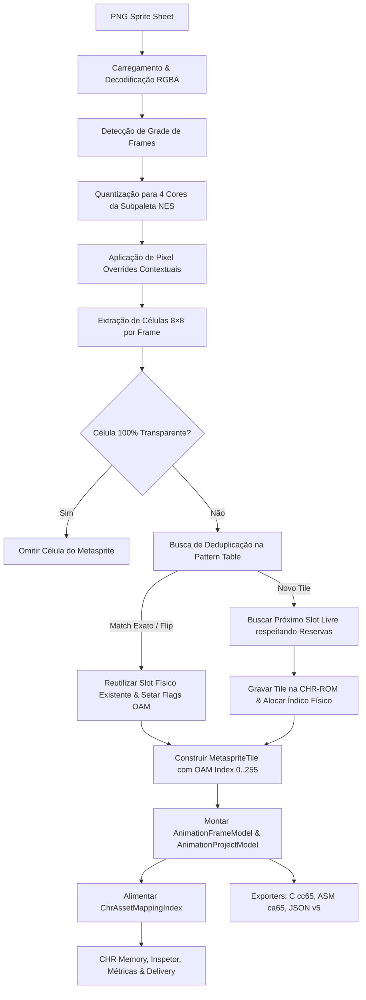

# Investigação Técnica: Integração Sprite Sheet → CHR (Milestone 7)

**Data:** 2026-08-25  
**Milestone:** 7. Sprite Sheet → CHR Integration  
**Issue de Referência:** #93  
**Status:** Concluído / Proposta Arquitetural

---

## 1. Resumo Executivo e Contexto

Com a conclusão das Milestones 5 (**CHR Regions & Reservations**) e 6 (**Tile Ownership & Asset Mapping**), o PNG2CHR Studio estabeleceu uma sólida fundação arquitetural de domínio:

1. Identidades estáveis de assets (`ProjectAssetId`) e chaves lógicas canônicas de tiles (`LogicalTileKey` no formato `${assetId}:${tileX}:${tileY}`);
2. Índice de mapeamento bidirecional puro e determinístico (`ChrAssetMappingIndex`);
3. Separação formal entre proveniência primária (`PhysicalTileOrigin`) e múltiplos usos ativos (`PhysicalTileUsage`), formalizando o invariante $Origin \neq Usage$;
4. Regiões organizacionais e Reservas de CHR bloqueantes de alocação no espaço físico de 8 KiB (PT0 e PT1);
5. Inspetor contextual de CHR, métricas factuais de recursos por asset e diagnósticos de integridade estruturados.

O objetivo da **Milestone 7 — Sprite Sheet → CHR Integration** é unificar de ponta a ponta o pipeline de spritesheets e animações à infraestrutura central de CHR. Uma spritesheet **não deve possuir nem assumir posições físicas na CHR-ROM**. Em vez disso, a spritesheet fornece frames e células de metasprites lógicos, enquanto o motor de alocação de CHR determina o posicionamento físico na Pattern Table configurada (PT0 ou PT1), respeitando ocupações de Base CHR, reservas bloqueantes de regions, deduplicação exata/flip-aware e compartilhamento entre múltiplos assets.

---

## 2. Glossário e Conceitos de Domínio

| Termo                                | Definição no PNG2CHR Studio                                                                                                                                                            |
| :----------------------------------- | :------------------------------------------------------------------------------------------------------------------------------------------------------------------------------------- |
| **Spritesheet**                      | Arquivo de imagem PNG quantizado contendo uma grade de frames regulares de sprites para uma ou mais animações.                                                                         |
| **ProjectAsset**                     | Entidade lógica registrada no projeto (`id`, `kind: 'spritesheet'`, `name`, `reference`), independente de como seus tiles estão dispostos na CHR física.                               |
| **LogicalTileKey**                   | Chave canônica de coordenadas do tile no asset fonte: `${assetId}:${tileX}:${tileY}`. Não se altera quando o tile é movido na CHR.                                                     |
| **Metasprite**                       | Estrutura lógica composta por uma coleção de sprites 8×8 de hardware montados em posições relativas `(x, y)` em torno de uma âncora de origem `(originX, originY)`.                    |
| **MetaspriteTile**                   | Componente 8×8 de um metasprite no frame, contendo coordenadas relativas, atributos NES (Flip H, Flip V, Subpaleta) e índice OAM.                                                      |
| **OAM Tile Index**                   | Índice local de 8 bits (`$00..$FF` / `0..255`) gravado na memória OAM do NES, referenciando a Pattern Table selecionada para sprites.                                                  |
| **Physical Tile Index**              | Índice global absoluto de 0 a 511 na memória CHR-ROM de 8 KiB (0..255 em PT0 e 256..511 em PT1).                                                                                       |
| **Omissão de Células Transparentes** | Regra crítica de hardware NES: células 8×8 100% transparentes são omitidas do metasprite para economizar slots na OAM (máximo 64) e evitar atingir o limite de 8 sprites por scanline. |

---

## 3. Mapeamento do Pipeline Atual (Ponta a Ponta)

O pipeline de conversão e alocação de spritesheets no código atual (`src/core/animation-model.ts`, `src/core/animation-mapping.ts`, `src/core/animation-exporters.ts` e `src/main.ts`) segue o fluxo:



### Análise Detalhada das Etapas:

1. **Entrada e Configuração:**
   - `AnimationDefinitionInput` recebe `image` (imagem indexada), `frameWidth`, `frameHeight`, `frameIndices`, `originX`, `originY`, `playback`, `flipH`, `flipV` e `pixelOverrides`.
2. **Extração de Tiles (`extractFrameTile`):**
   - Para cada frame selecionado, varre a grade de `widthTiles × heightTiles` células 8×8.
   - Células com pixels 100% transparentes (índice 0) são omitidas (`omittedTileCount += 1`).
3. **Deduplicação e Alocação:**
   - Para cada célula visível, `findTileMatch` busca na Pattern Table alvo se o padrão de pixels já existe (com ou sem transformações de espelhamento horizontal/vertical).
   - Se existir correspondência, reutiliza o `physicalTileIndex` e define os bits de flip OAM (`NES_SPRITE_FLIP_HORIZONTAL: 0x40`, `NES_SPRITE_FLIP_VERTICAL: 0x80`).
   - Se for novo, invoca `findNextAvailableChrSlot` (que pula slots reservados de `chrRegions`) e grava o tile no slot livre.
4. **Construção do Modelo de Projeto (`AnimationProjectModel`):**
   - Cada sprite recebe `tile: localPatternTableTileIndex(physicalTileIndex)` (`0..255`), `physicalTileIndex` (`0..511`), `attributes` (paleta + flags de flip), `x` e `y` ancorados em relação a `(originX, originY)`.
5. **Integração com Mapping e Visualização:**
   - `buildChrAssetMappingIndex` ingere o `animationModel` gerado e associa a cada slot físico suas origens e usos detalhados.

---

## 4. Diagnóstico de Problemas e Riscos Arquiteturais Atuais

Durante a auditoria do código, foram identificados os seguintes pontos de atenção que a Milestone 7 deve resolver formalmente:

1. **Acoplamento entre Extração e Alocação:**
   - Em `buildAnimationProjectModel`, a extração de células do PNG, a deduplicação, a alocação de slots físicos e a montagem das estruturas de dados de metasprites ocorrem todas dentro de um único loop aninhado de 200 linhas. Isso dificulta testes isolados de extração lógica vs. políticas de alocação de CHR.
2. **Tratamento de Multi-Spritesheets por Projeto:**
   - Embora o editor suporte múltiplas animações, o pipeline assume um único prefixo global de símbolos e uma única imagem primária em certas chamadas auxiliares. O pipeline deve tratar uniformemente múltiplos assets de spritesheet compartilhando a mesma CHR.
3. **Conflito de Origens em Reimportação:**
   - Quando um PNG de spritesheet é atualizado com novas dimensões ou novos frames, a invalidação e re-alocação de tiles deve preservar os overrides de pixels válidos e liberar os slots obsoletos sem causar fragmentação em outras animações.
4. **Resolução de Índices nos Exporters:**
   - Os exportadores de C e ASM utilizam `flatten(model)` que itera diretamente em `model.animations`. É essencial garantir que o índice gravado nos arrays de metasprites seja estritamente o índice OAM de 8 bits `tile` (`0..255`) e que o CHR binário exportado seja o buffer de 8 KiB consolidado.

---

## 5. Separação Estrita: Identidade Lógica vs. Posição Física

A arquitetura da Milestone 7 consagra a regra fundamental:

$$\text{Identidade Lógica (Source Coordinates)} \iff \text{Alocação Física (Pattern Table Slots)}$$

- **Identidade Lógica:**
  - Definida por `LogicalTileKey` (`${assetId}:${tileX}:${tileY}`).
  - Coordenadas `(tileX, tileY)` representam a posição da célula 8×8 no arquivo PNG original da spritesheet.
  - Independe totalmente de a animação estar alocada em PT0 ou PT1, ou de o slot físico ser $10 ou $A0.
- **Posição Física:**
  - Determinada exclusivamente pelo alocador central de CHR.
  - Representada por `physicalTileIndex` (`0..511`) e `tile` OAM local (`0..255`).
  - Pode mudar caso ocorra reorganização ou reimportação, mas as chaves lógicas e os overrides de pixels permanecem íntegros.

---

## 6. Integração com CHR Regions & Reservations

A integração de Spritesheets com a Milestone 5 garante que:

1. **Respeito a Reservas:** O alocador de spritesheets consulta `collectReservedPhysicalTileIndices(chrRegions)` e pula qualquer slot físico configurado como `kind: 'reservation'`.
2. **Capacidade Realista:** O limite de alocação de uma spritesheet em uma Pattern Table é $256 - \text{slots ocupados por Base CHR} - \text{slots reservados}$.
3. **Detecção de Overflow Determinística:** Se os tiles únicos da spritesheet excederem os slots disponíveis na Pattern Table selecionada, o sistema emite o erro estruturado `pattern-table-capacity-overflow` detalhando exatamente quantos tiles foram necessários e a capacidade restante.

---

## 7. Integração com Tile Ownership & Asset Mapping

A integração com a Milestone 6 garante que:

1. **Atribuição Automática de Origem:** Cada tile inédito alocado por uma spritesheet registra `PhysicalTileOrigin` com `primaryAssetId: asset.id`, `creationKind: 'extracted'` e sua `LogicalTileKey`.
2. **Rastreamento Fino de Usos:** Cada frame que renderiza uma célula gera um `PhysicalTileUsage` do tipo `'animation'`, contendo `animationId`, `frameIndex`, `spriteIndex`, flags de flip e coordenadas de origem.
3. **Métricas de Consumo Transparentes:** O consumo de CHR da spritesheet é refletido em tempo real nas métricas de `AssetChrMetrics` e nos painéis de Delivery.

---

## 8. Deduplicação (Intra-Asset, Inter-Frame, Flip-Aware) e Atributos OAM

A deduplicação é um dos pilares de economia de memória no NES:

1. **Deduplicação Idêntica (Same-Asset e Cross-Asset):**
   - Se dois frames ou duas animações diferentes utilizam o mesmo padrão de 8×8 pixels, eles compartilham o mesmo slot físico na CHR.
2. **Deduplicação com Espelhamento (Flip-Aware):**
   - Se uma célula for idêntica a um tile existente quando espelhada horizontalmente (Flip H), verticalmente (Flip V) ou em ambos os eixos (Flip H+V), o alocador não cria um novo tile. Em vez disso:
     - Aponta para o slot do tile original;
     - Define os bits 6 (`0x40`) e 7 (`0x80`) do byte de atributos do metasprite (`sprite.attributes`).
3. **Geração Automática de Animações Espelhadas:**
   - Quando a flag `exportMirroredDirection: true` estiver ativa em uma animação de movimento (ex: `walk_left`), o pipeline sintetiza deterministicamente a animação oposta (`walk_right`), espelhando as posições relativas dos sprites (`x' = -x - 8`) e invertendo o bit de flip horizontal.

---

## 9. Ciclo de Vida do Asset: Reimportação e Reconciliação

Quando uma spritesheet existente sofre alterações:

- **Substituição de Imagem:** A nova imagem é re-quantizada. `reconcilePixelOverridesForGeometry` remove overrides que caíram fora dos novos limites de largura/altura da imagem e retém os válidos.
- **Re-alocação Segura:** O alocador reconstrói os tiles. Se a imagem encolher, os slots exclusivos obsoletos são liberados. Se crescer, novos slots são alocados deterministicamente.
- **Preservação de IDs:** O `ProjectAssetId` e os IDs das animações (`anim.id`) permanecem imutáveis, garantindo que referências em cenas e inspeções de CHR não quebrem.

---

## 10. Persistência (`.p2c.json`) e Fronteiras de Estado

- **Persistido no Projeto:**
  - Configurações das animações: `id`, `name`, `entity`, `asset` (com `id` e `path`), `frameWidth`, `frameHeight`, `originX`, `originY`, `frameIndices`, `frameDurations`, `framePalettes`, `playback`, `flipDeduplication`, `destinationPatternTable`, `destinationChr` e `pixelOverrides`.
- **Derivado em Memória (Nunca Persistido):**
  - `AnimationProjectModel`, buffers CHR alocados, arrays de `MetaspriteTile` com índices físicos, `ChrAssetMappingIndex`, métricas e diagnósticos.

---

## 11. Pipeline de Exportação (JSON v5, C cc65, ASM ca65)

Os exportadores convertem o modelo unificado em artefatos prontos para produção:

1. **CHR Binária (`.chr`):** Arquivo de 8 KiB (ou 4 KiB) contendo os tiles de sprites na Pattern Table designada (PT0 ou PT1) e preservando Base CHR.
2. **Código C (`.h` / `.c` para cc65):**
   - Tabelas de sprites achatadas (`struct MetaspriteTile { signed char x, y; unsigned char tile, attr; }`);
   - Tabelas de frames (`struct MetaspriteFrame { unsigned char sprite_offset, sprite_count, duration; }`);
   - Tabelas de animações (`struct Animation { unsigned char frame_offset, frame_count, width_tiles, height_tiles, playback, flags; }`).
3. **Assembly ca65 (`.inc` / `.s`):**
   - Dados alinhados com diretivas `.byte`, bytes hexadecimais formatados (`$XX`) e constantes simbólicas tipadas.
4. **Metadados JSON v5 (`.json`):**
   - Especificação canônica completa contendo metadados de frames, omissão de células transparentes, durações e mapeamentos para ferramentas de tooling externas.

---

## 12. Diagnósticos de Integridade e Validação Pré-Export

A Milestone 7 deve garantir a detecção e sinalização dos seguintes cenários de erro ou alerta:

- `pattern-table-capacity-overflow`: Spritesheet exige mais tiles do que os slots disponíveis na Pattern Table.
- `tile-index-overflow`: Índice local do tile excede $FF (255).
- `invalid-frame-dimensions`: Largura ou altura do frame não é múltipla de 8 ou excede a resolução da imagem.
- `invalid-frame-selection`: Frame index fora dos limites da grade de frames da imagem.
- `no-selected-frames`: Animação configurada sem nenhum frame selecionado.
- `duplicate-animation-identifier`: Dois blocos de animação compartilham o mesmo nome ou símbolo C normalizado.
- `reservation-conflict`: Tentativa de alocação de spritesheet colidindo com uma CHR Reservation ativa.

---

## 13. Estratégia de Testes Automatizados

A suíte de testes da Milestone 7 deve cobrir os seguintes invariantes:

1. **Extração Lógica e Omissão de Transparência:** Células vazias não geram sprites na OAM;
2. **Deduplicação Exata e Flip-Aware:** Geração correta de atributos OAM e economia de slots;
3. **Respeito a CHR Reservations:** O alocador salta faixas reservadas e emite overflow se o espaço for insuficiente;
4. **Multi-Animação e Multi-Asset:** Compartilhamento seguro de CHR entre múltiplas entidades;
5. **Reconciliação em Reimportação:** Preservação de overrides válidos e descarte de inválidos em redimensionamento;
6. **Exportadores C/ca65/JSON:** Fidelidade exata de offsets, índices OAM e estimativa de consumo de ROM;
7. **Estabilidade de Persistência:** Deserialização $\rightarrow$ alocação $\rightarrow$ serialização sem mutação espúria de schema.

---

## 14. Backlog de Issues Recomendado para a Milestone 7

Recomendamos a decomposição da Milestone 7 nas seguintes **6 issues executáveis e ordenadas por dependência**:

```text
┌─────────────────────────────────────────────────────────────────────────────┐
│                   Sequência Incremental da Milestone 7                      │
├─────────────────────────────────────────────────────────────────────────────┤
│ 1. Core: Extração Lógica & Decoupling de Metasprites                        │
│                                    │                                        │
│                                    ▼                                        │
│ 2. Core: Alocador Unificado de CHR com Suporte a Regiões e Base CHR        │
│                                    │                                        │
│                                    ▼                                        │
│ 3. Core: Deduplicação Avançada (Flip-Aware) & Atributos OAM NES             │
│                                    │                                        │
│                                    ▼                                        │
│ 4. Core & UI: Reimportação, Geometria Dinâmica & Reconciliação de Overrides │
│                                    │                                        │
│                                    ▼                                        │
│ 5. Exporters: Alinhamento de Metasprites para C (cc65), ASM (ca65) e JSON v5│
│                                    │                                        │
│                                    ▼                                        │
│ 6. Quality: Auditoria E2E, Testes de Regressão & Documentação Viva          │
└─────────────────────────────────────────────────────────────────────────────┘
```

---

### Issue 1: `core: decoupled metasprite logical tile extraction and transparent cell omission`

- **Objetivo:** Isolar e formalizar o motor de extração lógica de células 8×8 a partir de frames de spritesheet, desacoplando a geração de metasprites da alocação física de CHR.
- **Escopo:**
  - Extração de tiles 8×8 por coordenadas de grade de frame `(tileColumn, tileRow)`;
  - Omissão precisa de células transparentes para otimização de OAM;
  - Atribuição de `LogicalTileKey` canônica para cada célula candidata;
  - Cálculo de âncoras de metasprites relativas a `(originX, originY)`.
- **Dependências:** Nenhuma (Primeira issue da milestone).
- **Critérios de Aceite:**
  - Células 100% transparentes não aparecem no array de sprites do metasprite;
  - Coordenadas de sprites `(x, y)` refletem a posição em pixels compensada pelo ponto de origem;
  - Cada célula lógica possui `logicalKey` estruturada e estável.

---

### Issue 2: `core: unified CHR allocation pipeline for spritesheets with regions and base CHR support`

- **Objetivo:** Integrar a alocação física de tiles de spritesheets ao motor central de slots de Pattern Table, respeitando Pattern Table selecionada (PT0/PT1), Base CHR e CHR Reservations.
- **Escopo:**
  - Utilizar `findNextAvailableChrSlot` com filtros de `reservedIndices` e `patternTable`;
  - Detecção e lançamento de erros estruturados de capacidade (`pattern-table-capacity-overflow`);
  - Suporte a múltiplas animações de diferentes entidades consumindo a mesma CHR física;
  - Preenchimento do buffer físico final de 8 KiB de CHR-ROM.
- **Dependências:** Issue 1.
- **Critérios de Aceite:**
  - Spritesheets nunca sobrescrevem faixas de reservas configuradas em `chrRegions`;
  - Base CHR pré-existente é preservada intacta;
  - Erros de falta de espaço informam a quantidade exata de tiles e capacidade restante.

---

### Issue 3: `core: flip-aware metasprite deduplication and OAM hardware attribute encoding`

- **Objetivo:** Padronizar a deduplicação exata e com espelhamento (H, V, H+V) para spritesheets, gerando atributos OAM NES válidos e integrando ao `ChrAssetMappingIndex`.
- **Escopo:**
  - Busca de correspondência de tiles considerando espelhamento horizontal e vertical;
  - Codificação de atributos OAM (bits 6 e 7 de flip, bits 0 e 1 de subpaleta);
  - Geração de animações espelhadas automáticas para movimento (`exportMirroredDirection`);
  - Registro de origens (`PhysicalTileOrigin`) e usos (`PhysicalTileUsage`) no mapeamento bidirecional.
- **Dependências:** Issues 1 e 2.
- **Critérios de Aceite:**
  - Tiles espelhados não consomem slots adicionais na CHR física;
  - O bit 6 do OAM é ativado para Flip H e o bit 7 para Flip V;
  - O Inspetor de CHR reflete fielmente o estado de espelhamento de cada uso.

---

### Issue 4: `core & ui: spritesheet reimport, frame geometry change, and pixel override reconciliation`

- **Objetivo:** Prover suporte robusto e determinístico para reimportação de PNGs de spritesheets e alteração de geometria de frames com reconciliação de overrides de pixel.
- **Escopo:**
  - Reconciliação de `pixelOverrides` via `reconcilePixelOverridesForGeometry` quando dimensões mudam;
  - Atualização do modelo do projeto sem mutação de `ProjectAssetId` ou corrupção de referências;
  - Liberação de slots físicos órfãos quando células deixam de existir;
  - Notificação de divergência caso tiles compartilhados sejam editados no editor de pixels.
- **Dependências:** Issues 1, 2 e 3.
- **Critérios de Aceite:**
  - Reimportar imagem menor descarta overrides órfãos sem travar a UI;
  - Reimportar imagem idêntica não causa churn ou realocação de slots físicos;
  - Nenhuma referência dangling é gerada no projeto.

---

### Issue 5: `exporters: align metasprite data generation for cc65 C, ca65 ASM and JSON v5`

- **Objetivo:** Garantir que todos os exportadores de código e metadados consumam o modelo canônico de spritesheets alocadas, gerando estruturas limpas, enxutas e prontas para ROMs de NES.
- **Escopo:**
  - Exportador C (cc65): headers `.h` e sources `.c` com structs achatadas de metasprites, frames e animações;
  - Exportador ASM (ca65): includes `.inc` e sources `.s` com diretivas de bytes formatadas e offsets de labels;
  - Exportador JSON: metadados no formato `png2chr-studio-animation` versão 5;
  - Cálculo exato da estimativa de consumo de ROM em bytes.
- **Dependências:** Issues 1, 2 e 3.
- **Critérios de Aceite:**
  - Structs C e tabelas ASM compilam diretamente em projetos cc65/ca65 sem necessidade de ajustes manuais;
  - Índices de tiles gravados no OAM utilizam o valor local de 8 bits `0..255`;
  - A estimativa de consumo de ROM reflete com precisão os bytes das tabelas exportadas.

---

### Issue 6: `quality: end-to-end spritesheet-to-CHR regression testing, documentation and smoke test`

- **Objetivo:** Realizar a auditoria final da Milestone 7, adicionar testes de regressão de ponta a ponta e sincronizar a documentação viva do repositório.
- **Escopo:**
  - Testes de integração cruzando Spritesheets + Base CHR + CHR Reservations + Exportadores;
  - Atualização de `docs/arquitetura.md`, `docs/formatos-e-exportacao.md`, `README.md` e `docs/stabilization-smoke-test.md`;
  - Verificação de ausência de regressões em Tileset e Playfield;
  - Validação estrita dos quality gates (`test`, `tsc`, `lint`, `format`, `build`).
- **Dependências:** Issues 1 a 5.
- **Critérios de Aceite:**
  - 100% dos testes automatizados passam sem falhas;
  - Zero erros de TypeScript, ESLint e Prettier;
  - Documentação viva descreve com precisão o pipeline de spritesheet consolidado.

---

## 15. Conclusão e Próximos Passos

A investigação técnica confirma que a arquitetura do PNG2CHR Studio está plenamente preparada para receber a **Milestone 7 — Sprite Sheet → CHR Integration**. A separação entre identidade lógica e alocação física, aliada à infraestrutura de Regions (Milestone 5) e Tile Ownership (Milestone 6), garante que as spritesheets sejam tratadas como assets lógicos de primeira classe sem violar as restrições rígidas de hardware do NES.

Recomenda-se a abertura das 6 issues acima no GitHub vinculadas à Milestone 7 para execução ordenada e incremental.
