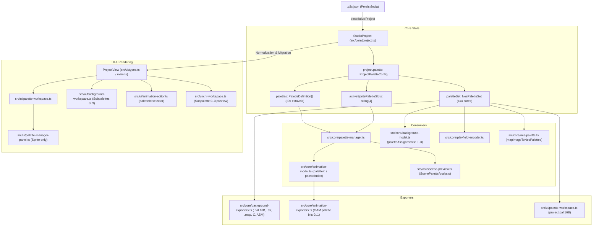
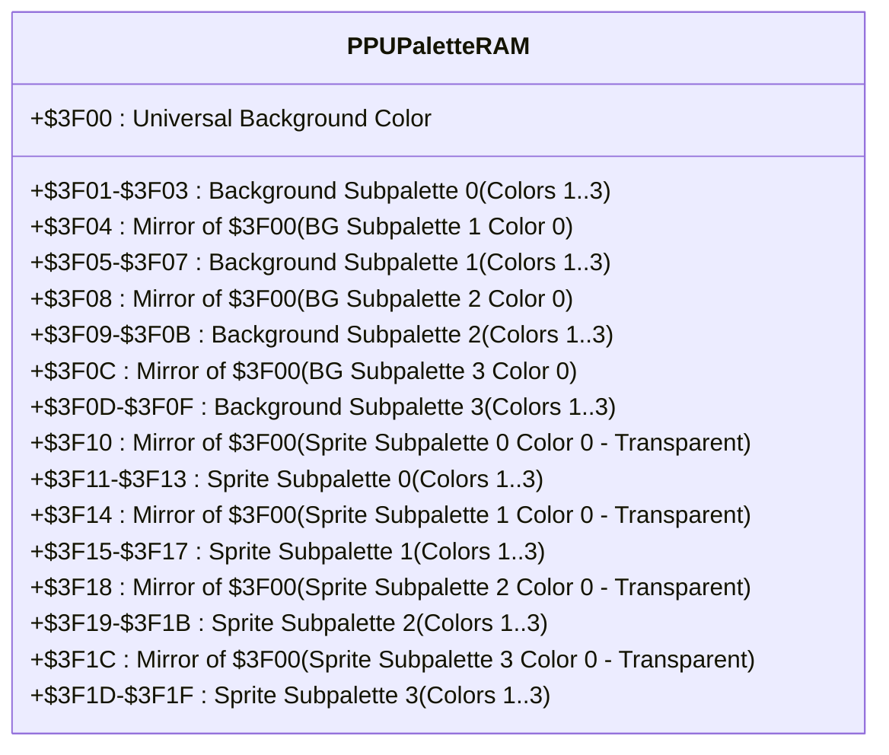
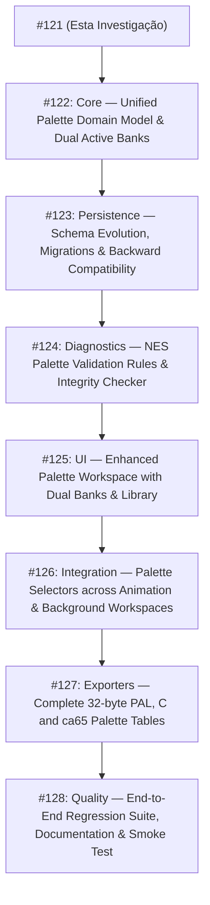

# Arquitetura e Especificação: Palette Manager (Milestone 9)

**Data:** 2026-08-26  
**Milestone:** 9. Palette Manager (Milestone #10)  
**Status:** Especificação Aprovada & Roadmap Definido  
**Autor:** Antigravity (Pair Programming AI)

---

## 1. Contexto e Motivação

Nas milestones anteriores (1 a 8), o **PNG2CHR Studio** consolidou pipelines cruciais para o desenvolvimento de jogos de NES:

- **Milestone 5 (CHR Regions & Reservations):** Bloqueio e reserva de slots de Pattern Table;
- **Milestone 6 (Tile Ownership & Asset Mapping):** Rastreamento bidirecional de posse com invariante $Origin \neq Usage$;
- **Milestone 7 (Sprite Sheet → CHR Integration):** Extração de metasprites, deduplicação com Flip H/V e atributos OAM;
- **Milestone 8 (Background Pipeline):** Domínio de Nametables (32×30), Attribute Tables (16×15 quadrantes / 64 bytes), alocação de CHR para fundos e exportação (.nam, .atr, .map, .pal, C, ca65).

Entretanto, o tratamento de **Paletas NES** no projeto ainda reflete uma transição incompleta entre o modelo legado (um array fixo de 4 subpaletas de 4 cores) e as necessidades reais de projetos modernos de NES:

1. **Conflito entre Sprites e Backgrounds:** O estado `project.paletteSet` é compartilhado globalmente; a edição de slots de sprites na UI sobrescreve a paleta usada por backgrounds e tilesets.
2. **Inconsistência da Cor Universal de Background ($3F00):** No hardware NES, o endereço PPU `$3F00` é a cor de fundo universal compartilhada por todos os fundos e espelhada para sprites. O modelo atual permite que subpaletas possuam cores 0 discrepantes sem aviso ou diagnóstico formal.
3. **Fragilidade de Referências:** Animações e metasprites usam tanto `paletteId` quanto `paletteIndex`, enquanto mapas de background usam apenas índices fixos `0..3` sem suporte a paletas nomeadas ou bancos comutáveis.
4. **Falta de Validação e Diagnósticos Centralizados:** O sistema não alerta sobre referências quebradas a paletas excluídas, excesso de paletas ativas em cenas simultâneas ou inconsistências de cor universal.

A **Milestone 9 — Palette Manager** tem como objetivo elevar as paletas a **recursos explícitos de primeira classe do projeto (`ProjectPalette`)**, provendo uma biblioteca de paletas nomeadas com IDs estáveis, bancos ativos separados para Background (PPU `$3F00..$3F0F`) e Sprites (PPU `$3F10..$3F1F`), rastreamento determinístico de uso em assets, diagnósticos formais e exportadores completos.

---

## 2. Auditoria do Modelo Atual e Mapeamento de Código

A auditoria de ponta a ponta inspecionou todos os módulos relacionados a paletas no repositório:

### 2.1 Fluxo de Dados Atual



### 2.2 Inventário de Módulos e Tipos Reais

| Arquivo                            | Responsabilidade Real                                                                                       | Tipos & Funções Principais                                                                                                                                                                                                                                                                                              |
| :--------------------------------- | :---------------------------------------------------------------------------------------------------------- | :---------------------------------------------------------------------------------------------------------------------------------------------------------------------------------------------------------------------------------------------------------------------------------------------------------------------- |
| `src/core/nes-palette.ts`          | Primitivas NES puras, cores master NTSC ($00..$3F), conversões e empacotamento de Attribute Table           | `NesPalette`, `NesPaletteSet`, `NES_MASTER_PALETTE`, `createDefaultNesPaletteSet`, `setNesPaletteColor`, `encodeNesBackgroundPalettes`, `mapImageToNesPalettes`, `encodePlayfieldAttributeTable`                                                                                                                        |
| `src/core/palette-manager.ts`      | Definições de paleta com ID estável, resolução de slots de sprites, análise de cenas e busca de referências | `PaletteDefinition`, `ActiveSpritePaletteSlots`, `SpritePaletteResolution`, `ScenePaletteAnalysis`, `PaletteUsageReference`, `generatePaletteId`, `findPaletteDefinition`, `resolveSpritePaletteSlot`, `resolveActivePaletteSet`, `resolveEffectivePaletteColors`, `analyzeScenePalettes`, `findPaletteUsageReferences` |
| `src/core/animation-palette.ts`    | Mapeamento de imagens indexadas de animação e renderização RGBA para sprites                                | `AnimationPaletteMapping`, `mapAnimationImageToNesPalette`, `renderIndexedImageWithPalette`                                                                                                                                                                                                                             |
| `src/core/project.ts`              | Schema persistido, deserialização, validação e migração de `.p2c.json`                                      | `ProjectPaletteConfig`, `StudioProject`, `deserializeProject`, `serializeProject`, `parsePaletteSet`, `parsePaletteDefinitions`, `parseActiveSlots`                                                                                                                                                                     |
| `src/core/background-model.ts`     | Modelo de Nametable e Attribute Table                                                                       | `BackgroundMapDefinition` (`paletteAssignments: readonly number[]`), `ResolvedNametableCell` (`paletteIndex: number`), `encodeBackgroundAttributeTable`                                                                                                                                                                 |
| `src/core/background-exporters.ts` | Exportação de Nametable, Attribute Table e binário `.pal`                                                   | `exportBackgroundPalette`, `generateCBackgroundExport`, `generateCa65BackgroundExport`                                                                                                                                                                                                                                  |
| `src/core/animation-exporters.ts`  | Exportação de metasprites em C, CA65 e JSON                                                                 | `generateCAnimationExport`, `generateCa65AnimationExport`, `exportAnimationJson`                                                                                                                                                                                                                                        |
| `src/ui/palette-workspace.ts`      | Tela principal do Palette Workspace e download de `.pal`                                                    | `createPaletteWorkspace`, `PaletteWorkspaceOptions`                                                                                                                                                                                                                                                                     |
| `src/ui/palette-manager-panel.ts`  | Painel visual de gerenciamento de definições e slots de sprites                                             | `createPaletteManagerPanel`, `createMasterPaletteDialog`                                                                                                                                                                                                                                                                |
| `src/ui/palette-editor.ts`         | Seletor de paleta para Playfield/Tileset legado                                                             | `createPaletteRows`, `PaletteEditorOptions`                                                                                                                                                                                                                                                                             |
| `src/ui/background-workspace.ts`   | Ferramenta de pintura de subpaletas (0..3) no grid 32×30                                                    | `createBackgroundWorkspace`, ferramentas de pintura e overlay de Attribute Table                                                                                                                                                                                                                                        |
| `src/ui/animation-editor.ts`       | Atribuição de `paletteId` e `framePaletteIds` em animações                                                  | Seletores de paleta por item e por frame                                                                                                                                                                                                                                                                                |
| `src/main.ts`                      | Estado em memória da aplicação e sincronização de mutações                                                  | `updateProjectPaletteColor`, `deleteProjectPalette`, `updateActiveSpritePaletteSlot`, etc.                                                                                                                                                                                                                              |

---

## 3. Problemas e Inconsistências Identificados

1. **Acoplamento Incorreto de Sprite e Background:**
   - Em `main.ts` (`updateProjectPaletteColor`, `deleteProjectPalette`, etc.), toda alteração em uma paleta de sprite invoca `resolveActivePaletteSet(palettes, activeSpritePaletteSlots)` e grava o resultado diretamente em `project.paletteSet`.
   - Como `background-workspace.ts` e `tileset-workspace.ts` consomem `project.paletteSet`, mudar a cor de um sprite altera imediatamente a cor do cenário e dos tilesets de fundo.
2. **Ausência de Banco de Slots para Background:**
   - Não existe `activeBackgroundPaletteSlots` no modelo do projeto. Backgrounds dependem de um array estático de 4 subpaletas sem possibilidade de selecionar paletas da biblioteca para compor o banco de fundo.
3. **Violação do Espelhamento de Hardware da Cor $3F00:**
   - `PaletteDefinition.colors` permite definir cores independentes no índice 0 (`colors[0]`).
   - Quando 4 definições diferentes são colocadas nos slots 0 a 3, a PPU virtual assume 4 cores de fundo distintas, o que é fisicamente impossível no NES (onde `$3F04`, `$3F08`, `$3F0C` são espelhos de `$3F00`).
4. **Campos Legados e Redundantes:**
   - `paletteIndex` e `paletteId` coexistem em `ProjectAnimationItemConfig` e `AnimationItemSetting`.
   - `framePalettes` e `framePaletteIds` coexistem em paralelo.
5. **Falta de Diagnósticos Estruturados de Paleta:**
   - Deletar uma paleta em uso substitui referências por `null` silenciosamente no projeto, mas não gera alertas formais no painel de diagnósticos do inspector se um asset referenciar uma paleta órfã.
   - Não há validação preventiva contra cenas com mais de 4 paletas de sprite simultâneas ou referências circulares.
6. **Exportadores Incompletos para Paletas:**
   - O único exportador `.pal` existente gera 16 bytes (apenas Background). Não existe exportação dos 32 bytes completos da PPU (16B Background + 16B Sprites), nem geração de tabelas de constantes C/ca65 dedicadas a paletas.

---

## 4. Objetivos e Não Objetivos

### Objetivos da Milestone 9:

- **Recurso de Primeira Classe (`ProjectPalette`):** Biblioteca unificada de paletas com IDs estáveis (`ProjectPaletteId`), nomes editáveis e 4 entradas de cor NES ($00..$3F).
- **Bancos Ativos Duplos (Dual Active Banks):** Representação explícita e separada dos 4 slots de Background (PPU `$3F00..$3F0F`) e dos 4 slots de Sprites (PPU `$3F10..$3F1F`).
- **Gestão Canônica da Cor Universal de Background ($3F00):** Definição centralizada da cor de fundo universal do projeto/mapa, com espelhamento transparente na UI e renderização fiel ao hardware.
- **Rastreamento de Uso Bidirecional:** Localizador visual e programático de onde cada paleta está sendo utilizada (animações, metasprites, frames, mapas de background, tilesets).
- **Validação e Diagnósticos NES:** Fatos estruturados para paletas inexistentes/órfãs, slots não preenchidos, conflitos de cor e overflow de paletas em cenas.
- **Exportação Abrangente:** Suporte a arquivos binários `.pal` de 16 e 32 bytes, além de arrays formatados em C (cc65) e Assembly (ca65).
- **Compatibilidade Retroativa Total:** Migração automática e determinística de projetos existentes com `formatVersion: 1`.

### Não Objetivos (Fora de Escopo):

- Não criar sistemas complexos de animação de paleta (palette cycling / color cycling) em tempo de execução via software (fora do escopo da ferramenta de assets estáticos);
- Não alterar as restrições físicas do hardware NES (4 cores por subpaleta, 4 subpaletas por banco);
- Não fundir bancos de sprites e background em um espaço único arbitrário sem correspondência com a PPU;
- Não remover prematuramente o suporte ao playfield legado de imagem única.

---

## 5. Conceitos e Terminologia Canônica

| Termo                                      | Significado no NES                                                                          | Representação no PNG2CHR Studio                                                          |
| :----------------------------------------- | :------------------------------------------------------------------------------------------ | :--------------------------------------------------------------------------------------- |
| **NES Color Code**                         | Índice de 6 bits ($00..$3F) na tabela mestre NTSC de 64 cores do 2C02.                      | `number` (inteiro $0..63$).                                                              |
| **Subpalette**                             | Conjunto lógico de 4 cores NES usado pela PPU para colorir um tile 8×8 de 2 bits por pixel. | `NesPalette = readonly [number, number, number, number]`.                                |
| **Palette Resource (`PaletteDefinition`)** | Entidade de autoria com ID estável, nome e 4 cores, armazenada na biblioteca do projeto.    | `PaletteDefinition { id: ProjectPaletteId; name: string; colors: NesPalette; ... }`.     |
| **Universal Background Color**             | Cor global exibida nas áreas transparentes do cenário (endereço PPU `$3F00`).               | `universalBackgroundColor: number` (ou `colors[0]` da subpaleta de fundo 0).             |
| **Active Background Slots**                | Os 4 slots de subpaleta (0..3) mapeados para a PPU em `$3F00..$3F0F`.                       | `activeBackgroundSlots: readonly (string \| null)[]` (tamanho 4).                        |
| **Active Sprite Slots**                    | Os 4 slots de subpaleta (0..3) mapeados para a PPU em `$3F10..$3F1F`.                       | `activeSpriteSlots: readonly (string \| null)[]` (tamanho 4).                            |
| **Palette Assignment / Attribute Bits**    | Valor de 2 bits (`0..3`) gravado na Attribute Table ou no byte de atributo da OAM.          | `paletteIndex: 0 \| 1 \| 2 \| 3` (resolvido a partir de `paletteId` e dos slots ativos). |

---

## 6. Modelo Proposto de Domínio

### 6.1 Estrutura em `src/core/palette-manager.ts`

```typescript
export type ProjectPaletteId = string;

/**
 * Definição declarativa de uma paleta na biblioteca do projeto.
 */
export interface PaletteDefinition {
  readonly id: ProjectPaletteId;
  readonly name: string;
  /** 4 cores NES ($00..$3F). No hardware, colors[0] é transparente em sprites ou reflete $3F00 em fundos. */
  readonly colors: NesPalette;
  /** Classificação de intenção de uso opcional para filtragem na UI. */
  readonly target?: 'sprite' | 'background' | 'shared';
}

/**
 * Configuração de slots ativos de hardware da PPU (4 slots de 4 cores cada).
 */
export type ActivePaletteSlots = readonly [
  ProjectPaletteId | null,
  ProjectPaletteId | null,
  ProjectPaletteId | null,
  ProjectPaletteId | null,
];

/**
 * Estado completo do subsistema de paletas no projeto persistido.
 */
export interface ProjectPaletteConfig {
  /** Cor universal de fundo do projeto ($3F00). */
  readonly universalBackgroundColor: number;
  /** Biblioteca completa de definições de paleta do projeto. */
  readonly palettes: readonly PaletteDefinition[];
  /** Slots ativos para Background (PPU $3F00..$3F0F). */
  readonly activeBackgroundSlots: ActivePaletteSlots;
  /** Slots ativos para Sprites (PPU $3F10..$3F1F). */
  readonly activeSpriteSlots: ActivePaletteSlots;
  /** Subpaleta e cor atualmente selecionadas para edição na UI (estado persistido de conveniência). */
  readonly activePaletteIndex?: number;
  readonly activeColorIndex?: number;
  /** Campo legado mantido para compatibilidade estrita durante migração. */
  readonly paletteSet?: NesPaletteSet;
  readonly activeSpritePaletteSlots?: readonly (string | null)[];
}
```

---

## 7. Mapeamento de Memória PPU e Espelhamento da Cor $3F00



### Regras Canônicas de Resolução:

1. **Renderização de Background:**
   - O pixel de valor `%00` sempre recebe a cor do endereço `$3F00` (`universalBackgroundColor`), independentemente de qual subpaleta (0..3) estiver associada ao quadrante da Attribute Table.
   - Os pixels de valores `%01`, `%10`, `%11` recebem as cores dos índices 1, 2 e 3 da subpaleta associada.
2. **Renderização de Sprites (OAM):**
   - O pixel de valor `%00` é sempre descartado como **transparente** (não desenha na tela e permite ver o background ou a cor universal por trás).
   - Os pixels `%01`, `%10`, `%11` usam as cores dos índices 1, 2 e 3 da subpaleta de sprite correspondente.
3. **Edição na UI:**
   - Alterar a cor universal atualiza `$3F00` e reflete imediatamente em todos os previews de background.
   - No editor de paleta de sprites, a cor 0 é apresentada com badge visual de "Transparente (reflete BG $3F00)".

---

## 8. Identidade Estável vs. Atribuição Física a Slots

Seguindo o invariante fundamental do Studio ($Logical \neq Physical$):

- **O Asset guarda o ID Lógico:** Animações e frames guardam `paletteId: "pal-hero-blue"`.
- **A Atribuição aos Slots é Dinâmica:** O usuário pode posicionar `"pal-hero-blue"` no Slot 0, Slot 1, Slot 2 ou Slot 3 do banco de sprites.
- **O Exportador Resolve para Hardware:** Ao exportar para OAM ou ca65, a função pura `resolveSpritePaletteSlot("pal-hero-blue", activeSpriteSlots)` descobre que a paleta está no Slot 2 e grava os bits `%10` no atributo do sprite.
- **Sem Quebra por Reordenação:** Reordenar as paletas na biblioteca ou alterar os slots não corrompe os assets; se uma paleta for removida de um slot ativo, os diagnósticos avisam imediatamente que o asset necessita de um slot alocado.

---

## 9. Ciclo de Vida das Paletas e Rastreamento de Uso

### Operações Suportadas:

1. **Criar Paleta (`createPaletteDefinition`):** Gera novo ID estável (`generatePaletteId`), nome padrão incremental e cores iniciais.
2. **Duplicar Paleta (`duplicatePaletteDefinition`):** Clona cores com novo ID e sufixo `(Copy)`.
3. **Renomear Paleta (`updatePaletteName`):** Atualiza nome descritivo sem afetar referências.
4. **Editar Cores (`updatePaletteColor`):** Modifica uma das cores via diálogo com as 64 cores mestre do NES.
5. **Excluir Paleta (`deletePalette`):**
   - Executa busca determinística de referências (`findPaletteUsageReferences`).
   - Se houver usos ativos em animações, frames, mapas ou slots, solicita confirmação e executa limpeza segura ou reatribuição para fallback.
6. **Atribuir a Slot (`assignPaletteToSlot`):** Coloca uma paleta da biblioteca em um dos 4 slots de Background ou Sprite.
7. **Rastreamento de Uso (`findPaletteUsageReferences`):** Mapeia referências em:
   - Slots de Hardware (`activeBackgroundSlots`, `activeSpriteSlots`);
   - Animações e Metasprites (`anim.paletteId`);
   - Overrides de Frame (`anim.framePaletteIds`);
   - Mapas de Background (futura extensão de paletas nomeadas por mapa);
   - Instâncias em Cenas (`scenePreview`).

---

## 10. Persistência, Schema e Compatibilidade

### 10.1 Schema `.p2c.json` (Retrocompatível)

O formato persistido permanece em `formatVersion: 1`, acomodando as novas propriedades de forma transparente:

```json
{
  "formatVersion": 1,
  "name": "Megaman Project",
  "mode": "animation",
  "palette": {
    "universalBackgroundColor": 15,
    "palettes": [
      {
        "id": "pal_hero_main",
        "name": "Mega Man Blue",
        "colors": [15, 17, 33, 48],
        "target": "sprite"
      },
      {
        "id": "pal_bg_stage1",
        "name": "Cutman Stage Bricks",
        "colors": [15, 6, 22, 38],
        "target": "background"
      }
    ],
    "activeBackgroundSlots": ["pal_bg_stage1", null, null, null],
    "activeSpriteSlots": ["pal_hero_main", null, null, null],
    "activePaletteIndex": 0,
    "activeColorIndex": 1
  }
}
```

### 10.2 Normalização e Migração Automática (`deserializeProject`)

1. Se `rawPalette.palettes` não existir, deriva a partir de `paletteSet` legado (`createDefaultPaletteDefinitions`).
2. Se `rawPalette.activeSpriteSlots` não existir, migra a partir de `activeSpritePaletteSlots` legado ou dos primeiros 4 IDs.
3. Se `rawPalette.activeBackgroundSlots` não existir, cria slots apontando para as primeiras 4 paletas de fundo.
4. Se `rawPalette.universalBackgroundColor` não existir, adota `paletteSet[0][0]` ou `$0F` (preto padrão).
5. Animações com `paletteIndex` numérico são automaticamente convertidas para `paletteId` estável.

---

## 11. Validação NES e Diagnósticos

O subsistema de diagnósticos receberá fatos estruturados específicos (`PaletteDiagnosticFact`):

| Tipo de Diagnóstico            | Severidade | Condição de Disparo                                                                      | Ação Sugerida                                                             |
| :----------------------------- | :--------- | :--------------------------------------------------------------------------------------- | :------------------------------------------------------------------------ |
| `dangling-palette-reference`   | `error`    | Asset (animação/frame) referencia `paletteId` inexistente na biblioteca.                 | Reatribuir a uma paleta válida ou recriar a definição.                    |
| `unassigned-active-slot`       | `warning`  | Asset em uso ativo referencia paleta que não está atribuída a nenhum dos 4 slots ativos. | Atribuir a paleta a um slot livre (0..3) no banco correspondente.         |
| `slot-capacity-exceeded`       | `error`    | Cena ou frame requer simultaneamente mais de 4 subpaletas de sprite.                     | Reutilizar subpaletas ou unificar cores de sprites para caber em 4 slots. |
| `invalid-nes-color`            | `error`    | Código de cor fora da faixa $00..$3F.                                                    | Corrigir o índice de cor para a faixa válida de 6 bits do NES.            |
| `inconsistent-universal-color` | `warning`  | Subpaleta de fundo possui cor 0 diferente da cor universal global `$3F00`.               | Alinhar a cor com a cor universal ou sincronizar o projeto.               |

---

## 12. Exportadores

A exportação de paletas contemplará:

1. **Binário de Paleta de Background (`.pal` - 16 bytes):** Os 16 bytes das 4 subpaletas ativas de background (`$3F00..$3F0F`).
2. **Binário de Paleta Completa da PPU (`.pal` - 32 bytes):** Os 32 bytes completos da PPU (16B Background seguidos de 16B Sprites).
3. **Exportação C (cc65):**
   ```c
   /* Paletas de Background (16 bytes) */
   const unsigned char palette_bg[16] = {
       0x0F, 0x01, 0x11, 0x21,
       0x0F, 0x06, 0x16, 0x26,
       0x0F, 0x09, 0x19, 0x29,
       0x0F, 0x03, 0x13, 0x23
   };

   /* Paletas de Sprites (16 bytes) */
   const unsigned char palette_spr[16] = {
       0x0F, 0x11, 0x21, 0x30,
       0x0F, 0x05, 0x15, 0x25,
       0x0F, 0x17, 0x27, 0x37,
       0x0F, 0x00, 0x10, 0x30
   };
   ```
4. **Exportação Assembly (ca65):**
   ```ca65
   .segment "RODATA"
   .export _palette_bg, _palette_spr

   _palette_bg:
       .byte $0F, $01, $11, $21
       .byte $0F, $06, $16, $26
       .byte $0F, $09, $19, $29
       .byte $0F, $03, $13, $23

   _palette_spr:
       .byte $0F, $11, $21, $30
       .byte $0F, $05, $15, $25
       .byte $0F, $17, $27, $37
       .byte $0F, $00, $10, $30
   ```

---

## 13. Arquitetura de UX do Palette Manager

O **Palette Workspace** será organizado em quatro seções principais:

1. **Barra de Ferramentas Superior:**
   - Indicador e seletor da **Cor Universal de Background ($3F00)**;
   - Botão `+ Nova Paleta`;
   - Filtros de visualização (`Todas`, `Sprites`, `Backgrounds`, `Em Uso`).
2. **Seção de Slots Ativos de Hardware (Hardware Banks):**
   - **Banco 1 — Background (Slots 0..3 / PPU $3F00..$3F0F):** 4 cards com dropdown para vincular paletas da biblioteca e preview das 4 cores;
   - **Banco 2 — Sprites (Slots 0..3 / PPU $3F10..$3F1F):** 4 cards correspondentes aos slots OAM, com indicação visual da cor 0 como transparente.
3. **Lista / Grade da Biblioteca de Paletas:**
   - Cards de paleta com edição inline de nome, 4 swatches interativos para abrir o `MasterPaletteDialog` (64 cores NES), badge de contagem de usos, botão Duplicar e botão Excluir com modal de impacto de assets.
4. **Painel Lateral / Inspetor de Uso:**
   - Exibe a lista detalhada de assets que consomem a paleta selecionada e lista eventuais diagnósticos de integridade.

---

## 14. Estado Canônico vs. Estado Transitório

- **Estado Canônico Persistido (`StudioProject.palette`):**
  - `universalBackgroundColor`: número ($00..$3F);
  - `palettes`: lista de `PaletteDefinition`;
  - `activeBackgroundSlots`: 4 IDs ou `null`;
  - `activeSpriteSlots`: 4 IDs ou `null`.
- **Estado Transitório de UI (`WorkspaceState` / DOM):**
  - Paleta selecionada para foco no inspetor (`selectedPaletteId`);
  - Slot ativo em edição rápida;
  - Filtro ativo na biblioteca (`all | sprite | background | in-use`);
  - Estado aberto/fechado do modal mestre de cores.

---

## 15. Roadmap de Implementação e Fatiamento de Issues

Para transformar esta especificação em incrementos executáveis, a Milestone 9 será dividida em **8 issues sequenciais**:



### Detalhamento das Issues:

1. **Issue 1 (Core):** `core: add unified palette domain model, stable palette IDs and dual-bank active slots`
   - Tipos canônicos, pure functions para resolução de slots duplos (BG e SPR), helpers de cor universal e busca pura de referências.
2. **Issue 2 (Persistence):** `persistence: integrate dual-bank palette schema into project serialization and migrations`
   - Atualização de `StudioProject`, deserialização retrocompatível, normalização determinística e roundtrip tests.
3. **Issue 3 (Diagnostics):** `core: add palette diagnostics for dangling references, slot overflow and color consistency`
   - Fatos estruturados de integridade de paletas integrados a `diagnostics.ts` e auditoria de cenas.
4. **Issue 4 (UI Workspace):** `ui: rebuild Palette Workspace with dual hardware banks, library management and usage inspector`
   - Interface visual com bancos de Background e Sprite, edição com diálogo mestre de 64 cores e contadores de uso.
5. **Issue 5 (Consumer Integration):** `ui: integrate palette selectors and color preview across animation, background and CHR workspaces`
   - Sincronização dos novos bancos ativos com o Background Workspace (ferramenta de subpaletas) e Animation Editor (seletores de `paletteId`).
6. **Issue 6 (Exporters):** `exporters: add 32-byte PPU palette binary, C headers and ca65 assembly palette tables`
   - Exportação pura de `.pal` (16B e 32B), `.h`/`.c` e `.inc`/`.s` com tabelas separadas para background e sprites.
7. **Issue 7 (Quality & Documentation):** `quality: complete Palette Manager end-to-end regression suite and documentation sync`
   - Testes E2E ponta a ponta, auditoria de invariantes NES, atualização do `README.md` e `docs/arquitetura.md`.

---

## 16. Riscos, Trade-offs e Decisões Tomadas

| Tópico                          | Alternativas Avaliadas                                                                                              | Decisão Escolhida                            | Justificativa Arquitetural                                                                                                          |
| :------------------------------ | :------------------------------------------------------------------------------------------------------------------ | :------------------------------------------- | :---------------------------------------------------------------------------------------------------------------------------------- |
| **Identidade de Paleta**        | 1. Índices numéricos `0..3`<br>2. Nomes como chave<br>3. IDs estáveis (`ProjectPaletteId`)                          | **IDs estáveis (`generatePaletteId`)**       | Evita corrupção em reordenações e renomeações; separa o identificador de autoria da posição física no hardware.                     |
| **Bancos de Paletas**           | 1. Banco único compartilhado de 4 slots<br>2. Banco unificado de 8 slots<br>3. Dois bancos dedicados (4 BG + 4 SPR) | **Dois bancos dedicados de 4 slots**         | Espelha fielmente a PPU do NES ($3F00..$3F0F e $3F10..$3F1F), eliminando o bug de sprites sobrescreverem fundos.                    |
| **Cor Universal ($3F00)**       | 1. Cada subpaleta tem sua própria cor 0<br>2. Cor 0 fixa no projeto                                                 | **Cor 0 global no projeto com espelhamento** | O hardware do NES possui apenas um registrador em `$3F00`. Simular cores 0 diferentes geraria previews impossíveis no console real. |
| **Compatibilidade de Arquivos** | 1. Quebrar formato antigo<br>2. Suportar migração silenciosa                                                        | **Migração automática idempotente**          | Garante que arquivos `.p2c.json` das versões 0.1 a 0.13 continuem abrindo sem erros.                                                |

---

## 17. Questões Deliberadamente Adiadas

- **Palette Cycling / Animações de Paleta em Tempo de Execução:** Troca dinâmica de cores por frame durante gameplay depende de rotinas 6502 customizadas de cada engine e não faz parte da gestão de assets estáticos do Studio.
- **Paletas Dinâmicas por Scanline (Raster Splits via Mapper IRQ):** Técnicas avançadas (como troca de paleta no meio da tela via MMC3) serão avaliadas em milestones posteriores focadas em mappers.
